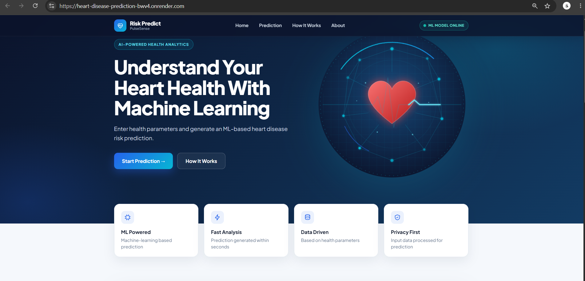
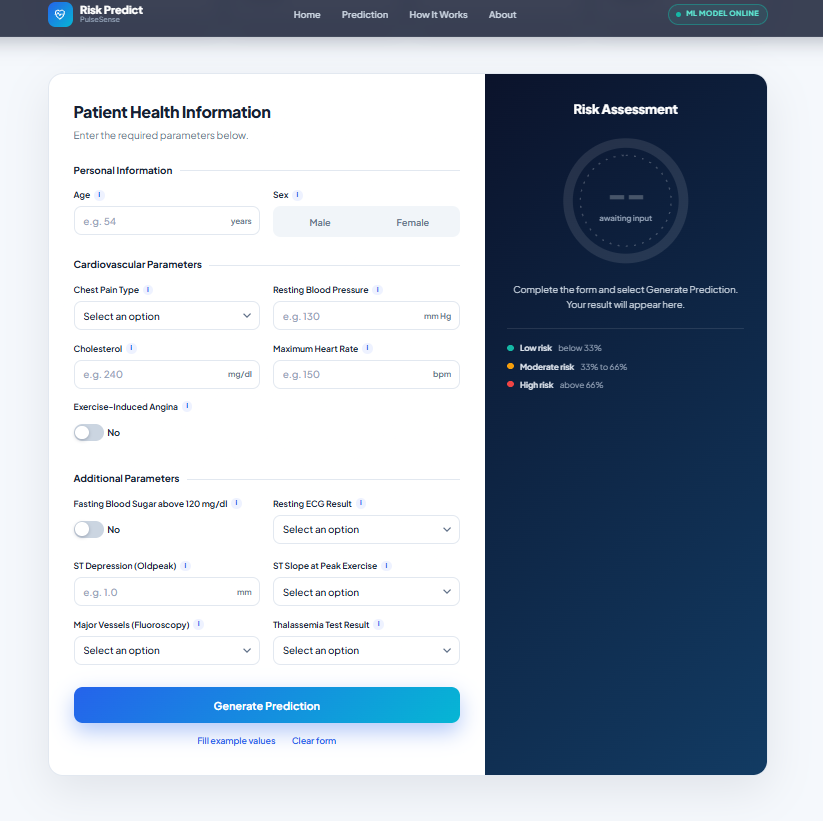

# Risk Predict: Heart Disease Prediction Web App

An educational machine-learning web app that estimates heart disease risk from 13 clinical measurements. Built as a workshop project with scikit-learn and Flask.

**Live demo:** https://heart-disease-prediction-bwv4.onrender.com

> The site is hosted on a free tier and sleeps when idle. The first visit can take 30 to 60 seconds to load.

## Screenshots






## Features

- Form with all 13 input features, grouped into personal, cardiovascular and additional parameters
- Tooltips explaining the medical terms
- Risk gauge with a Low, Moderate or High band
- "Fill example values" button for quick demos
- Responsive layout for desktop and mobile

## Tech stack

Python, pandas, scikit-learn (Random Forest), Flask, HTML, CSS, JavaScript. Deployed on Render with gunicorn.

## Dataset

UCI Heart Disease (Cleveland): 303 records, 13 features, binary target.

Input features: `age, sex, cp, trestbps, chol, fbs, restecg, thalach, exang, oldpeak, slope, ca, thal`

## Model performance

Evaluated on a stratified 20% test set (61 patients):

| Metric | Result |
|---|---|
| Accuracy | 82% |
| Recall for heart disease | 64% |

The model misses about a third of patients with heart disease in the test set, so it should not be used as a screening tool. Recall for the disease class matters more than accuracy in a medical setting.

## Project structure

```
heart-disease-prediction/
├── data/heart.csv
├── model/
│   ├── heart_model.pkl
│   └── scaler.pkl
├── screenshots/
├── static/style.css
├── templates/index.html
├── app.py              # Flask app
├── train_model.py      # trains and saves the model
├── requirements.txt
└── README.md
```

## Run locally

```
pip install -r requirements.txt
python train_model.py
python app.py
```

Then open http://127.0.0.1:5000

## Notes

- In this copy of the dataset, `target = 1` means **no disease**. The app therefore uses the model's probability for class 0 as the heart disease risk.
- Risk bands: Low below 33%, Moderate 33% to 66%, High above 66%.

## Disclaimer

Educational project only. It is trained on a small dataset and cannot diagnose or rule out heart disease. This is not medical advice. Speak to a qualified clinician about any health concern.
